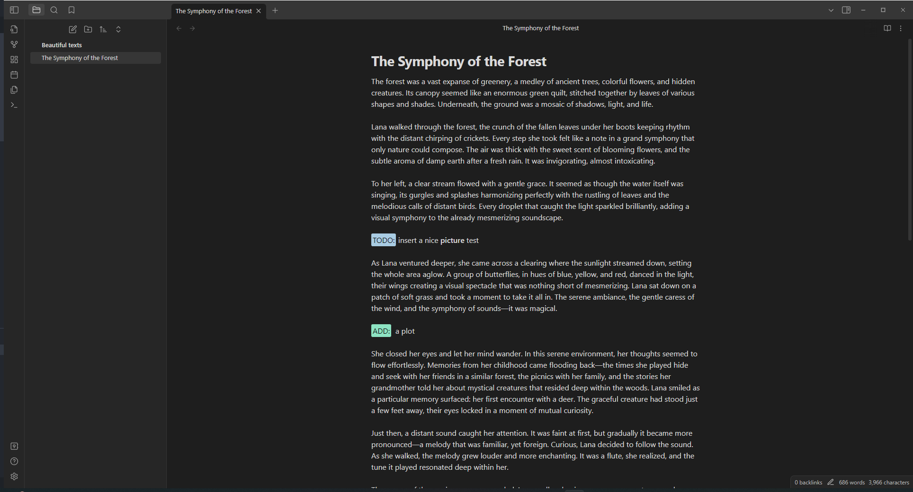
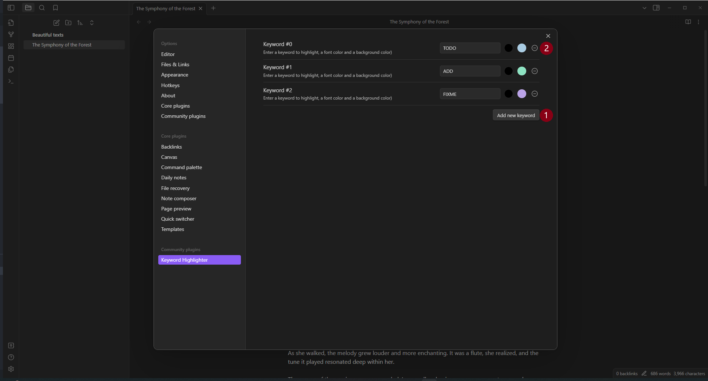

# Keyword Highlighter Plugin

## Overview



The Obsidian Keyword Highlighter is a powerful plugin designed for Obsidian users who wish to enhance their note-taking experience. This plugin allows you to highlight specific keywords in your notes, making it easier to locate and organize important information. It's perfect for researchers, students, and professionals who deal with large volumes of text and need a quick way to identify key concepts.

## How it works



### Use the keyword highlighting

To use the highlighting write down the Keyword followed by a colon `:`. There are three predefined keywords: _TODO_, _ADD_, _FIXME_. For example to highlight a new Todo you can simply write `TODO: prepare a ☕`.

### Add a new keyword

To add a new keyword just press the button `Add new keyword` (1). Then enter the keyword, followed by the font color and the background color. That's it!

### Edit a keyword

Well, that's easy! Just edit the keyword or the font and background colors.

### Remove a keyword

Easy aswell, just hit the delete button (2).

## Installation


### Build from source

#### Prerequisites

- [Node.js](https://nodejs.org/) (v18 or later recommended)
- npm (bundled with Node.js)

#### Steps

1. Clone the repository:
   ```bash
   git clone https://github.com/<your-username>/obsidian-keyword-highlighter.git
   cd obsidian-keyword-highlighter
   ```

2. Install dependencies:
   ```bash
   npm install
   ```

3. Build the plugin:
   ```bash
   npm run build
   ```
   This runs TypeScript type-checking and then bundles everything with esbuild. The output files are `main.js`, `manifest.json`, and `styles.css`.

   > For a development/watch build (auto-rebuilds on file changes), run `npm run dev` instead.

4. Copy the output files to your vault's plugin folder:
   ```
   <your-vault>/.obsidian/plugins/keyword-highlighter/
   ├── main.js
   ├── manifest.json
   └── styles.css
   ```

5. Restart Obsidian (or reload plugins) and enable **Keyword Highlighter** in **Settings → Community plugins**.


## Debugging

In console (`ctrl-shift-i`)

```
app.plugins.plugins["keyword-highlighter-dev"].constructor


```
